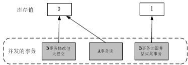
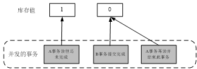
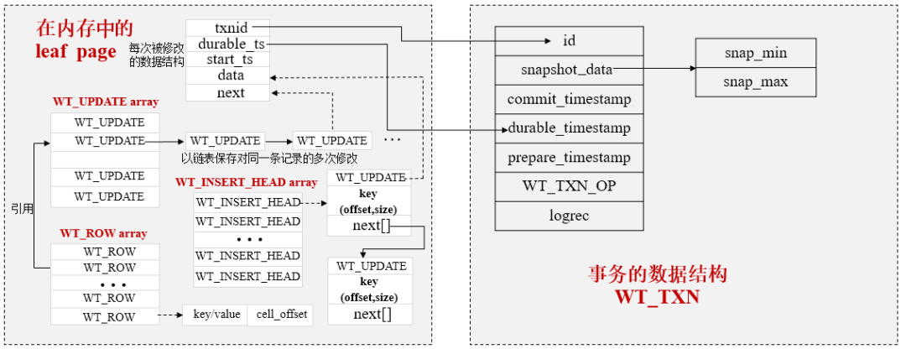
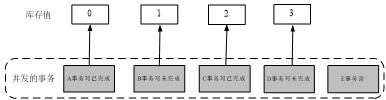
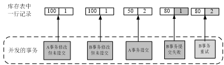

> MongoDB作为领先的NoSQL，为了支撑更多的需求场景，也在不断完善其功能。从早期支持大吞吐量读/写操作的MMAPv1存储引擎，到引入支持高并发操作的WiredTiger存储引擎，以及对事务功能的持续演进，MongoDB不仅保留了最初的架构优势，同时又汲取了其他数据库的优点。
>
> MongoDB从 3.0版本引入WiredTiger存储引擎之后开始支持事务，MongoDB 3.6之前的版本只能支持单文档的事务，从MongoDB 4.0版本开始支持复制集部署模式下的事务，从MongoDB 4.2版本开始支持分片集群中的事务。

#### 事务的基本原理

与关系型数据库一样，MongoDB事务同样具有ACID特性，说明如下：

- 原子性（Automicity）：一个事务要么完全执行成功，要么不做任何改变。
- 一致性（Consistency）：当多个事务并行执行时，元素的属性在每个事务中保持一致。
- 隔离性（Isolation）：当多个事务同时执行时，互不影响。WiredTiger本身支持多种不同类型的隔离级别，如读-未提交（read-uncommitted）、读-已提交（read-committed）和快照（snapshot）隔离。MongoDB默认选择的是快照隔离。
- 持久性（Durability）：一旦提交事务，数据的更改就不会丢失。

**在不同隔离级别下，一个事务的生命周期内，可能出现脏读、不可重复读、幻读等现象。**

下面介绍这3种现象出现的场景与含义。

**1. 脏读现象**

例如，某款手机在数据库中的库存还有1部，客户A发起一个查询手机库存的事务，同时，客户B发起了一个购买手机的事务（但未提交事务），此时客户A读到手机库存为0部，认为售完了。但客户B突然不想购买这款手机了，于是回滚了此事务，手机库存又变为1部，客户A读到的手机库存为0部就是一个脏读数据，如下图所示。



**2. 不可重复读现象**

例如，某款手机在数据库中的库存还有1部，客户A发起一个查询手机库存的事务（事务还未完成），读到其值为1。同时，客户B发起了一个购买手机的事务（提交了事务），此时客户A再次查询手机库存，读到其值为0。客户A在同一个事务中读到的同一条记录的取值不一样，这种现象就是不可重复读，如下图所示。



**3. 幻读现象**

例如，某款手机在数据库中的库存还有1部，客户A发起一个购买手机的事务（事务还未完成），读到其值为1。同时，管理员B发起了一个增加1部手机的事务（提交了事务），此时客户A再次查询手机库存，读到其值为1（有新增数据）。客户A在同一个事务中本来应该读到的库存值为0，认为手机已经售完，但发现库存中还有1部手机，客户A两次读到的数据集不一样，这种现象就是幻读，如下图所示。


下面介绍与事务相关的数据结构，如下图所示。



其中，

**（1）id字段：**这是事务的全局唯一标识，通过分析它与具体的操作关联，就能够知道一个事务包含哪些操作。

**（2）snapshot_data字段：**MongoDB使用的是快照隔离级别的事务，这个字段用于保存事务的快照信息，具体来说它会有snap_min和snap_max两个属性，通过这两个属性能够计算一个事务开始时的数据范围，每个事务开始时都会构造一个这样的快照。

**（3）commit_timestamp字段：**表示事务提交的时间。

**（4）durable_timestamp字段：**表示事务修改的数据已持久化的时间，与具体操作中的durable_ts字段关联。

**（5）prepare_timestamp字段：**表示事务开始准备的时间。

**（6）WT_TXN_OP字段：**包含事务的修改操作，用于事务回滚和生成事务日志（Journal）。

**（7）logrec字段：**表示事务日志的缓存，用于在内存中保存事务日志（对于MongoDB来说Journal日志就是事务日志）。

**事务的snapshot隔离**

WiredTiger存储引擎支持read-uncommitted、read-committed和snapshot3种事务隔离级别，MongoDB启动时默认选择snapshot隔离。

事务开始时，系统会创建一个快照，从已提交的事务中获取行版本数据，如果行版本数据标识的事务尚未提交，则从更早的事务中获取已提交的行版本数据作为其事务开始时的值。

通过事务可以看到其他还未提交的事务修改的行版本数据，但不会看到事务id大于snap_max的事务修改的数据。

快照数据的获取流程如下图所示。



假设图中的5个事务对同一条记录进行操作，E事务开始时，生成的快照数据包含B、D两个未完成的事务，同时获取离它最近且完成了的C事务修改后的值作为事务开始时的取值，即2。

如果E事务为写事务，对库存值进行修改，则会进行冲突检测，以防止对过期数据的修改，保证数据的一致性（如D事务在E事务提交之前完成，行版本已发生变化，若E事务还要进行修改，则提交时会产生冲突）。

通过一段代码加深对快照隔离级别事务的认识：

```text
session1 = client.start_session()  //开启一个session
```

任何事务都是封装在一个session中进行的。

**MVCC并发控制机制**

要实现事务之间的并发操作，可以使用锁机制或MVCC控制等。对于WiredTiger来说，使用MVCC控制来实现并发操作，相较于其他锁机制的并发，MVCC实现的是一种乐观并发机制。

MVCC并发控制机制如下图所示：



**（1）**A事务首先从表中读取要修改的行数据，读取的库存值为100，行记录的版本号为1。

**（2）**B事务也从中读取要修改的相同行数据，读取的库存值为100，行记录的版本号为1。

**（3）**A事务修改库存值后提交，同时行记录版本号加1，变为2，大于A事物一开始读取行记录版本号1，A事务可以提交。

**（4）**但B事务提交时发现此时行记录版本号已经变为2，产生冲突，B事务提交失败。

**（5）**B事务尝试重新提交，此时再次读取的版本号为2，加1后版本号变为3，不会产生冲突，正常提交B事务。

**事务日志（Journal）**

Journal是一种WAL（Write Ahead Log）事务日志，目的是实现事务提交层面的数据持久化。

Journal持久化的对象不是修改的数据，而是修改的动作，以日志形式先保存到事务日志缓存中，再根据相应的配置按一定的周期，将缓存中的日志数据写入日志文件中。

事务日志落盘的规则如下。

**（1）按时间周期落盘。**

在默认情况下，以50毫秒为周期，将内存中的事务日志同步到磁盘中的日志文件。

**（2）提交写操作时强制同步落盘。**

当设置写操作的写关注为j:true时，强制将此写操作的事务日志同步到磁盘中的日志文件。

**（3）事务日志文件的大小达到100MB。**